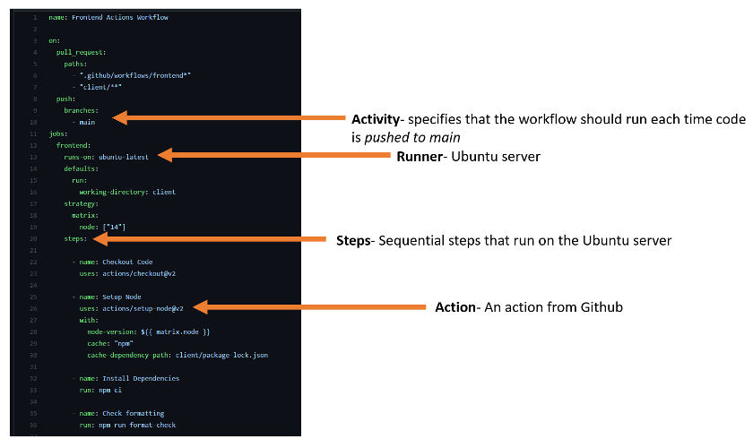

# Chapter 12: Adding CI/CD to Your Project

```{note}
There are many tools available to create a CI/CD pipeline. This
guide will demonstrate using GitHub Actions.
```

## GitHub Actions

| Key Terms | Meaning                                                                                                                          |
|-----------|----------------------------------------------------------------------------------------------------------------------------------|
| Workflows | Automated procedure that can be triggered by some event. Written in YAML.                                                        |
| Events    | An activity that triggers a workflow to be executed. For example, pushes to main branch.                                         |
| Jobs      | Set of steps that execute on the same runner. Multiple jobs run in parallel.                                                     |
| Steps     | Individual task that runs command within a job. Executes shell commands or actions. Multiple steps run sequentially.             |
| Actions   | Standalone commands that are combined into steps. There are actions published by the Github community which you can use as well. | 
| Runner    | The server that the workflows run within.                                                                                        |

### Create Your First Workflow

1. Create a directory from the root of your repository called
    .github/workflows.
2. Create a new file for your workflow. You can name this anything, but
    it must be a YAML file. For example, ci-cd.yaml.
3. Add the following example workflow and modify/add steps as required.

```
name**:** learn-github-actions\
on**:** **\[**push**\]**\
jobs**:**\
check-bats-version**:**\
runs-on**:** ubuntu-latest\
steps**:**\
**-** uses**:** actions/checkout@v2\
**-** uses**:** actions/setup-node@v2\
with**:**\
node-version**:** \'14\'\
**-** run**:** npm install -g bats\
**-** run**:** bats -v
```

The steps above were obtained from the GitHub Actions
[documentation](https://docs.github.com/en/actions/learn-github-actions/understanding-github-actions#create-an-example-workflow).

### Understanding the Workflow Syntax



### Viewing Your Workflow Execution

Once your workflow is triggered, you should be able to see its execution
under the Actions tab in your GitHub repository. If any step fails,
GitHub will clearly indicate the step that failed and show any logs that
can be useful to understand why it has failed.

### Steps to Include in Your Pipeline

1. Build your application
    1.  Install necessary dependencies
2. Perform any formatting/linting checks
3. Test your application
    1.  Unit testing
    2.  Integration testing

```{admonition} Extra Resources
To build your first project using GitHub Actions, you can take 
[GitHub's free course](https://lab.github.com/githubtraining/github-actions:-hello-world).

You can watch this explainer in a free [YouTube video](https://www.youtube.com/watch?v=5MJRtldPOEI).
```
